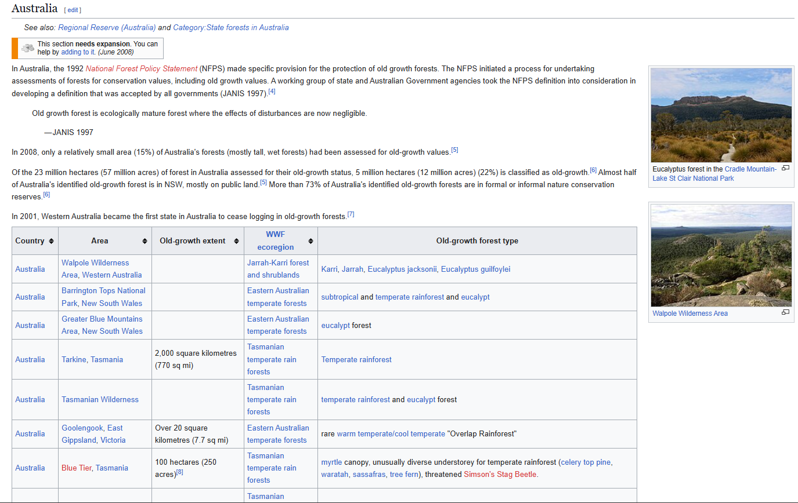

# Introduction

**Purpose:** To extract and analyse data from the tables on [List of old growth forests](https://en.wikipedia.org/wiki/List_of_old-growth_forests) Wikipedia article using `BeautifulSoup` in Python. This dataset contains loads of data inconsistencies, which will need to be dealt with properly.



# Checking if We Can Scrape

Checking if the website allows for scraping by reading its `robots.txt` file.


```python
import urllib.robotparser
```


```python
def can_scrape(url: str, user_agent: str = "*") -> bool:
    # create an instance of robot parser
    rp = urllib.robotparser.RobotFileParser()

    # parse the robots.txt file on the website
    rp.set_url(url + "/robots.txt")
    rp.read()

    # check if scraping is allowed for the given user agent
    return rp.can_fetch(user_agent, url)
```


```python
website_url = "https://www.wikipedia.org"
user_agent = "*"

can_scrape(website_url, user_agent)
```


    True


# Webscraping Pipeline

## Requesting Webpage and Creating BeautifulSoup Object

1. Importing libraries.


```python
import requests
from bs4 import BeautifulSoup
import re
```

2. Define custom function for getting HTML page, calling it on the url and saving it.


```python
def get_html(url, path):
    response = requests.get(url)
    with open(path, "w", encoding = "utf-8") as f:
        f.write(response.text)

url = "https://en.wikipedia.org/wiki/List_of_old-growth_forests"

get_html(url, path="HTML/wiki_old_forrest.html")
```

3. Create `BeautifulSoup` object and extract all tables from `wikitable sortable` classes.


```python
with open("HTML/wiki_old_forrest.html", "r", encoding = "utf-8") as f:
    html = f.read()

soup = BeautifulSoup(html, "html.parser")
tables = soup.find_all("table", attrs={"class": "wikitable sortable"})
```

## Data Preprocessing

### Create Necessary Metadata

1. Extract the table names based on previous headers in the HTML.


```python
data = {}
for table in tables:
    headings = table.find_previous(["h2", "h3"]).text
    data[headings] = table

data.keys()
```


    dict_keys(['Africa', 'Asia', 'Australia', 'Europe', 'Canada', 'United States', 'Central America', 'Caribbean', 'South America'])


2. Extract the headers of tables from the first row, using the Australia table as template.


```python
table = data["Australia"]
first_row = table.tr

columns = []
for td in first_row:
    if td.text.strip() != "":
        columns.append(td.text.strip())

columns
```


    ['Country',
     'Area',
     'Old-growth extent',
     'WWF ecoregion',
     'Old-growth forest type']


3. QUICKFIX: There is a missing td in United States table (lol), so in order for everything to work we need to REMOVE THE WHOLE DATASET.


```python
del data["United States"]
```


```python
data.keys()
```


    dict_keys(['Africa', 'Asia', 'Australia', 'Europe', 'Canada', 'Central America', 'Caribbean', 'South America'])


### Define Functions for Preprocessing

1. Function that extracts row data and return a dictionary column names as keys, and corresponding table data as values.


```python
def extract_row_data(columns, row):
    row_data = {}
    table_cells = row.find_all("td")
    
    for i in range(len(table_cells)):
        row_data[columns[i]] = table_cells[i]

    return row_data
```

2. Function that formats the row data dictionary. It does several functions:

- Formats cells with whitespace (empty cells) with `No data` string
- Replace dead link `<a>` tags with their text and removes citation links
- Formats inconsistent `Old-growth extent` data by extracting numeral values with units using `RegEx`


```python
def clean_row_data(row: dict):

    for k in row.keys():
        val = row[k]

        if re.match("\s", val.text):
            row[k] = "No data"

        links = val.find_all("a")

        for l in links:
            # Replace dead link <a> tags with their text
            if l.get("title") is not None and "(page does not exist)" in l.get("title"):
                l.replace_with(l.text)

            # Remove citation links
            if "cite" in l.get("href"):
                l.parent.decompose()

        if k == "Old-growth extent" and row[k] != "No data":
            data = row[k].text.strip()

            # format space to proper unicode character
            data = data.replace("\xa0", " ")
            
            # finds 2,000 | 7,800,000 units
            data = re.search("\d+(?:,\d{3})*(?:\.\d*)? (?:hectares|square kilometres|ha|acres)", data).group()

            parent = row[k].parent
            row[k].decompose()

            new_tag = soup.new_tag("td")
            new_tag.string = data
            parent.append(new_tag)

            row[k] = new_tag

    return row
```

3. Function that extracts `tr` tags from tables, removes the header row, and processes each row via `extract_row_data` and `clean_row_data` functions.


```python
def prepare_table_data(columns, table):
    table_data = []

    rows = table.find_all("tr")
    rows.pop(0)

    for r in rows:
        r = extract_row_data(columns=columns, row=r)
        r = clean_row_data(r)
        table_data.append(r)

    return table_data
```

4. Function that iterates through the tables stored in `data` dictionary via its keys and calls `prepare_table_data` on them.


```python
def prepare_all_tables(columns, data):
    for k in data.keys():
        data[k] = prepare_table_data(columns, data[k])

    return data
```

### Preprocess the Dataset


```python
data = prepare_all_tables(columns, data)
```

# Data Analytics

## Question: How many of the listed forests are in France?


```python
europe = data["Europe"]
france = [r for r in europe if "France" in r["Country"].text]
len(france)
```


    12


## Question: How many of the listed forests are in Tasmania?


```python
len([r for r in data["Australia"] if "Tasmania" in r["Area"].text])
```


    6


## Question: In tasmania, of those that have data, what is the total area of these?


```python
australia = data["Australia"]
tasmania = [r for r in data["Australia"] if "Tasmania" in r["Area"].text]
tasmania_area_data = [r for r in tasmania if r["Old-growth extent"] != "No data"]

total = 0
for r in tasmania_area_data:
    area = r["Old-growth extent"].text
    
    # remove , from numbers
    area = area.replace(",", "")

    # extracts digits
    val = re.search("\d*", area).group()
    val = float(val)

    # normalise data to common units
    if "square kilometres" in area:
        val = val * 100

    total += val

print("Total area for Tasmania forests:", total, "ha")
```

    Total area for Tasmania forests: 200100.0 ha
    

## Question: From the data of Bulgaria's forests, what is the proportion of Bulgaria's total area that is covered by these?

To answer this question we need to find Bulgaria's total area. We will do it by scraping Bulgaria's wikipedia page.

1. Isolate Old Growth data that is in Bulgaria.


```python
bulgaria_rows = []
for row in data["Europe"]:
    if row["Country"].text.strip() == "Bulgaria":
        bulgaria_rows.append(row)
```

2. Extract Bulgaria's wikipedia page via the link contained in `Area` columns and use it to parse the website and create a `BeautifulSoup` object.


```python
# get the link of the bulgaria article
bulgaria_link = "https://wikipedia.org" + bulgaria_rows[0]["Country"].a["href"]

get_html(bulgaria_link, path="HTML/bulgaria.html")
```


```python
get_html(bulgaria_link, path="HTML/bulgaria.html")
with open("HTML/bulgaria.html", "r", encoding = "utf-8") as f:
    html_bulgaria = f.read()
    
bulgaria_soup = BeautifulSoup(html_bulgaria, "html.parser")
bulgaria_soup.title
```


    <title>Bulgaria - Wikipedia</title>


3. Create a function that extracts total Bulgaria's area from the Wikipedia's article quick info table.


```python
def get_bulgaria_area(tag):
    return tag.name == "td" and 'km' in tag.text and 'Total' in tag.parent.text

km_tags = [t.text for t in bulgaria_soup.find_all(get_bulgaria_area)]

area_tag = km_tags[0]
area_tag
```


    '110,993.6[3]\xa0km2 (42,854.9\xa0sq\xa0mi) (103rd)'


4. Extract the number of kilometres squared using `RegEx` anc convert it to hectares.


```python
b_area = re.search("\d+(?:,\d{3})*(?:\.\d*)?", area_tag).group()
b_area = float(b_area.replace(',', ''))

b_area = b_area * 100 # transforms km2 to ha
```

5. Extract the size of `Old Growth Extent` and calculate its percentage from the total Bulgaria's area.


```python
forest_total = 0
for row in bulgaria_rows:
    forest_data = row['Old-growth extent'].text
    forest_data = re.search("\d+(?:,\d{3})*(?:\.\d*)?", forest_data).group()
    forest_data = float(forest_data.replace(',', ''))

    forest_total += forest_data

print(f'Percentage of bulgarian land area accounted for old growth: {round((forest_total / b_area)*100, 4)}%')

```

    Percentage of bulgarian land area accounted for old growth: 9.9747%
    
